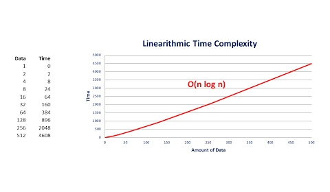

---
tags:
  - Computer_Science/Algorithm-Complexity/Complexity
---
# Linearithmic Complexity
Linearithmic complexity is a mix between [linear](Linear-Complexity.md) & [logarithmic](Logarithmic-Complexity.md) complexity. They scale better than linear, but they don't scale as well as logarithmic.

