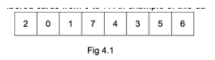

# Big-O-Exam-Question
A 1-dimensional array stores a set of numbered cards from 0 to 7. An example of this data is shown in Fig in 4.1:

A programmer is writing a computer program to sort the cards into the correct order (0 to 7).  Sorting algorithms the programmer could have used are a merge sort, bubble sort, and insertion sort. The worst case scenario for Merge is O(n log(n)) and for Bubble and insertion is O(n^2).

Compare the use of a merge sort and a bubble sort and an insertion sort on this array, evaluating the performance of each sort, making reference to the worse case Big O notation

- For Knowledge points (4) describe how each algorithm works
- For application (4 points) explain the big O for each algorithms including best, worst and average case time complexity and space complexity
- For evaluation points (4) evaluate the fitness for each in the circumstances shown but also consider should the circumstances change

You can use the internet to research your answer

---

Bubble sort works by iterating over the array, comparing adjacent values. If the second value is smaller than the first value, swap it.
The best case for bubble sort is O($n$). The average & worst case is O($n^2$). The space complexity is O($1$).

Insertion sort works by iterating & checking if the next element is bigger than the previous element. If it finds an element that is out of order it swaps the first & last element. It then keeps moving back in the array with the element until it's in order. It then jumps back to the index the element was original at & keeps iterating over the array. The best case for insertion sort is O($n$). The average & worst case is O($n^2$). The space complexity is O($1$).

Merge sort works by recursively splitting the array into smaller sub-arrays until each array contains only one element. It then builds back up the initial array from the sub-arrays, sorting each time a sub-array is combined. The best, worst & average case for merge sort is O($n×log(n)$). It has a space complexity of O($n$).

I'd say that merge sort would be the best for this, as it will soft the array faster than either bubble or insertion sort. If the array was to get bigger then merge sort will be much quicker compared to the other two. However space complexity could start to become a worry. If the array was made smaller I'd choose insertion sort as it is quicker than bubble sort, even if it scales the same.