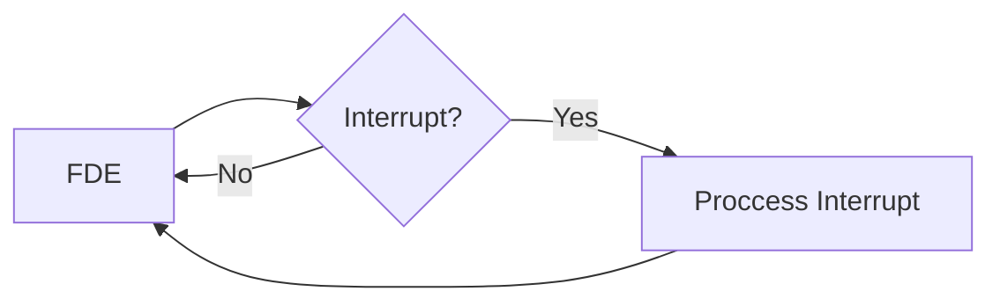

---
tags:
  - Computer_Science/Revision/1_2
---
# Interrupt Handling

Interrupts can come from multiple different sources, such as:
- Hardware
- Software
- CPU Clock

Interrupts are checked at the end of every FDE cycle

When a process is interrupted the current process context (the values of the registers, etc) is pushed onto the stack before the interrupt is executed. This allows the previous program context to be restored upon interrupt completion.

### Priority
Different interrupts have different priorities.
If an interrupt is being executed, but one with a higher priority is triggered, the interrupt will be interrupted by the higher priority one. The original context is retained by pushing and popping from the stack like with regular programs.