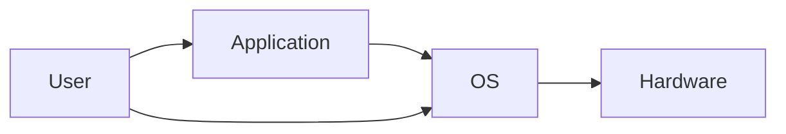

---
tags:
  - Computer_Science/Revision/1_2
aliases:
  - OS
---
# Operating Systems
An Operating System is loaded into RAM by the bootloader after the computer turns on.

The OS manages the hardware, providing an interface for programs and the user to interact with it.

Main functions provided by OS:
- User interface
- [[Computer-Science/Revision/Component 1.2/Memory Management|Memory Management]]
- [[Computer-Science/Revision/Component 1.2/Interrupt Handling|Interrupt Handling]]
- [[Computer-Science/Revision/Component 1.2/Processor Scheduling|Processor Scheduling]]