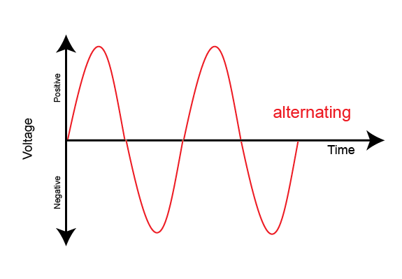

---
tags:
  - Electronics
---
# Alternating Current
Alternating current has a waveform similar to a sine wave. This means that its [Voltage](Voltage/Voltage.md) varies over time. The frequency of Alternating Current is 50Hz in the UK power grid.

