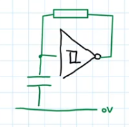
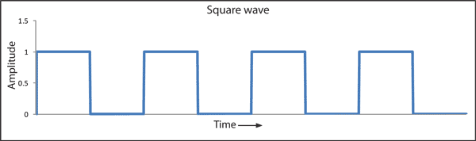

# Relaxation Oscillator

A [Relaxation Oscillator](Relaxation%20Oscillator.md) is an example of an [Astable Circuit](Astable%20Circuit.md).
See the [Circuit](../Circuits/Circuit.md) bellow:

The [Relaxation Oscillator](Relaxation%20Oscillator.md) produces a square wave output:

This makes the [Relaxation Oscillator](Relaxation%20Oscillator.md) a good fit for [Logic Gates](../Logic%20Gates/Logic%20Gates.md).

The frequency of the output wave can be calculated using the formula:
$F = 1/RC$
- $F$ - frequency
- $R$ - [Resistance](../Resistance/Resistance.md)
- $C$ - [Capacitance](../Capacitance/Capacitance.md)