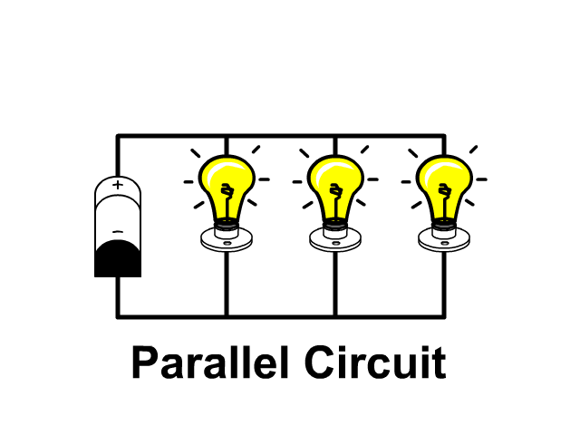

# Parallel Circuit
In a [Parallel Circuit](../../..//Electronics/Circuits/Parallel%20Circuit.md) the components are connected in separate branches. This gives the [Current](../Ohms%20law/Current.md) lots of paths to travel through. The result of this is if a component in a branch failed, it would only created a gap in one of the paths. Only that branch wouldn't work, the other branches would continue working.

#### Key Facts:
- [Current](../Ohms%20law/Current.md) is different in each branch of the [Circuit](Circuit.md).
- Total [Resistance](../Ohms%20law/Resistance.md) decreases for components added in parallel.
- The [Voltage](../Ohms%20law/Voltage.md) is the same across all components in parallel.

Animation of a [Parallel Circuit](../../..//Electronics/Circuits/Parallel%20Circuit.md)[^1]
s

[^1]: Credit: [stickmanphysics.com](http://stickmanphysics.com/stickman-physics-home/unit-8-current-and-circuits/series-circuit/)