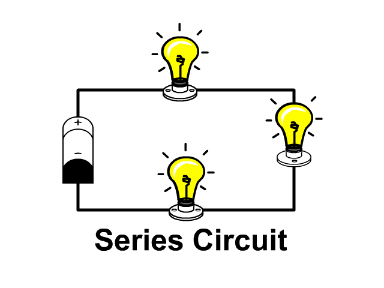

# Series Circuit
In a [Series Circuit](../../..//Electronics/Circuits/Series%20Circuit.md) components are connected one after the other, with the end of one component only being connected to the start of another component. This means that if one of the components were to fail, it would create a gap in the [Circuit](Circuit.md) & the entire thing would stop working.

#### Key Facts:
- [Current](../Ohms%20law/Current.md) is equal across every component / part of the [Circuit](Circuit.md)
- [Voltage](../Ohms%20law/Voltage.md) is the sum of the [Voltage Drop](../Voltage%20Drop.md) over every component in the [Circuit](Circuit.md)
- [Resistance](../Ohms%20law/Resistance.md) is equal to the value of all the [Resistances](../Ohms%20law/Resistance.md) summed up.

Animation of a [Series Circuit](../../..//Electronics/Circuits/Series%20Circuit.md)[^1]

[^1]: Credit: [stickmanphysics.com](http://stickmanphysics.com/stickman-physics-home/unit-8-current-and-circuits/series-circuit/)