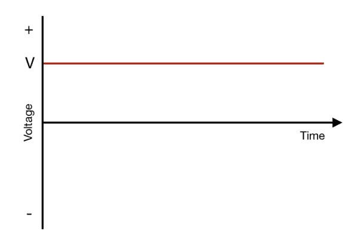

# Direct Current
Direct current has a waveform with a constant[^1] [[Ohms%20law/Voltage.md]].

[^1]: [DC](../..//Electronics/DC.md) doesn't always have a constant voltage. It can sometimes vary over time, such as with [Full Wave Rectifier](Power%20Supply%20Units/Full%20Wave%20Rectifier.md) or [Half wave rectifier](Power%20Supply%20Units/Half%20wave%20rectifier.md).