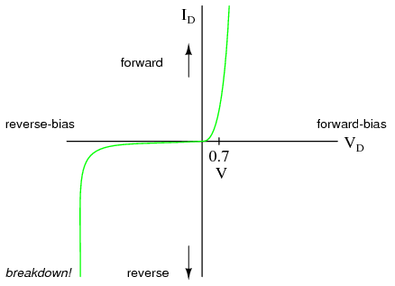

# Zener Diodes
A [Zener Diodes](Zener%20Diodes.md) is often used to regulate [Voltage](../Voltage/Voltage.md). This is because once the [Zener Diodes](Zener%20Diodes.md) begins to conduct [Current](../Ohms%20law/Current.md) (this is know as the Zener current) the [Voltage](../Voltage/Voltage.md) doesn't change, regardless how larger the [Current](../Ohms%20law/Current.md) becomes.

[Zener Diodes](Zener%20Diodes.md) are precise components, so they are expensive compared to other types of [Diodes](Diodes.md). They also are used differently. In [Silicone Diodes](Silicone%20Diodes.md) or [Light Emitting Diodes](Light%20Emitting%20Diodes.md), if a high [Voltage](../Voltage/Voltage.md) is passed through the [Diodes](Diodes.md) in the wrong direction, they will break. However, with [Zener Diodes](Zener%20Diodes.md), they are designed to have [Current](../Ohms%20law/Current.md) flow through them in the "wrong" direction. As they are calibrated to "break" at the specific [Voltage](../Voltage/Voltage.md), but [Zener Diodes](Zener%20Diodes.md) don't break destructively, allowing them to be used again.

This graph shows how the [Zener Diodes](Zener%20Diodes.md) behave. The [Voltage](../Voltage/Voltage.md) at which breakdown occurs can be any [Voltage](../Voltage/Voltage.md).
