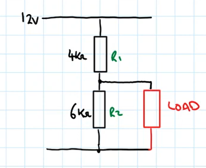
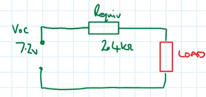

# Equivalent Circuit
An [Equivalent Circuit](Equivalent%20Circuit.md) is a simplified [Circuit](../Circuits/Circuit.md) that other [Circuits](../Circuits/Circuit.md) can be converted to.

An example of a [Circuit](../Circuits/Circuit.md) to create an [Equivalent Circuit](Equivalent%20Circuit.md) from:
 

There are three steps to calculating an [Equivalent Circuit](Equivalent%20Circuit.md):
1. Calculate the $V_{oc}$ (Open [Circuit](../Circuits/Circuit.md) [Voltage](../Voltage/Voltage.md)), to do this calculate the [Voltage Drop](../Voltage/Voltage%20Drop.md) over $R_2$.
2. Calculate the $I_{sc}$ ([Current](../Ohms%20law/Current.md) [Short Circuit](../Short%20Circuit.md)), to do this imagine the $Load$ has 0 [Resistance](../Ohms%20law/Resistance.md), all the [Voltage](../Voltage/Voltage.md) drops over $R_1$ . Use [Ohms Law](../Ohms%20law/Ohms%20Law.md) to calculate the resulting [Current](../Ohms%20law/Current.md) to get $I_{sc}$ .
3. Calculate the $R_{equiv}$ (Equivalent [Resistance](../Ohms%20law/Resistance.md)), to do this use [Ohms Law](../Ohms%20law/Ohms%20Law.md) to calculate the [Resistance](../Ohms%20law/Resistance.md) from the $V_{oc}$ & $I_{sc}$ .

This is the [Equivalent Circuit](Equivalent%20Circuit.md) from the above [Circuit](../Circuits/Circuit.md):

It's constructed from the $V_{ov}$ and the $R_{equiv}$ that was previously calculated. This [Circuit](../Circuits/Circuit.md) can now be used to calculate various values using [Ohms Law](../Ohms%20law/Ohms%20Law.md) within the [Equivalent Circuit](Equivalent%20Circuit.md).