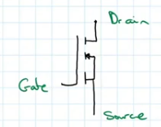

# MOSFET
A [MOSFET](../../..//Electronics/MOSFET/MOSFET.md) is a [Voltage](../Voltage/Voltage.md) controlled device, that can act as an "electronically controlled switch".
Bellow is shown a labelled N channel enhancement MOSFET.

When working with MOSFETs we can use this formula to calculate values:
$I_D = g_m(V_{gs} - V_{th})$
- $I_D$ - Drain [Current](../Ohms%20law/Current.md)
- $g_m$ - [Transconductance](Electronics/Transconductance.md).
- $V_{gs}$ - [Voltage](../Voltage/Voltage.md) in the gate, compared to the source [Voltage](../Voltage/Voltage.md)
- $V_{th}$ - Threshold [Voltage](../Voltage/Voltage.md)