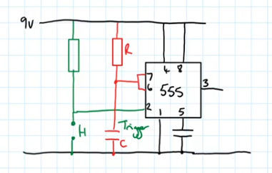

# Monostable 555
A [Monostable 555](Monostable%20555.md) is an [Integrated Circuit](../Integrated%20Circuit.md). It's most common use is for creating a [Monostable Circuit](Monostable%20Circuit.md), an example of this is shown bellow:

The [Monostable 555](Monostable%20555.md) is triggered by a low-going pulse from the trigger wire (the green wire that connects to 2).
The Resistor & [Capacitor](../Capacitance/Capacitor.md) on the red wire are responsible for the [Pulse Length](Pulse%20Length.md) of the output. The output can be approximated with the formula:
$T = 1.1 * RC$
- $T$ - Time of the [Pulse Length](Pulse%20Length.md) in seconds.
- $R$ - [Resistance](../Resistance/Resistance.md) of the resistor on the red wire
- $C$ - The [Capacitance](../Capacitance/Capacitance.md) of the [Capacitor](../Capacitance/Capacitor.md) on the red wire