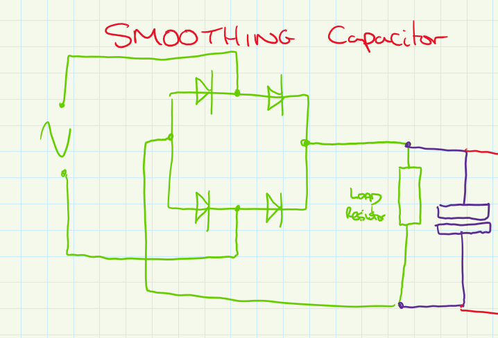

# Full Wave Rectifier
A [Full Wave Rectifier](Full%20Wave%20Rectifier.md) is used to convert [AC](../AC.md) to [DC](../DC.md)

Example [Circuit](../Circuits/Circuit.md) for a [Full Wave Rectifier](Full%20Wave%20Rectifier.md):

Example waveform for a [Full Wave Rectifier](Full%20Wave%20Rectifier.md):

In a full wave rectifier, the [Current](../Ohms%20law/Current.md) follows through 2 [Diodes](../Diodes/Diodes.md) (the other two are used to block the [Current](../Ohms%20law/Current.md)), which means the [Peak Voltage](Peak%20Voltage.md) (peak voltage) drops by 1.4V ([Diodes](../Diodes/Diodes.md) have a 0.7V drop). Also, the frequency of the [DC](../DC.md) waveform is double that of the [AC](../AC.md) value. This is because the rectifier is converting both the low & high [Peak Voltage](Peak%20Voltage.md) of the [AC](../AC.md) waveform. However, a constant [Voltage](../Ohms%20law/Voltage.md) isn't output, the value is subject to [Voltage Ripple](Voltage%20Ripple.md).

However, the output [DC](../DC.md) waveform isn't constant, it varies by huge amounts. To help smooth out the [DC](../DC.md) [Voltage](../Ohms%20law/Voltage.md) a smoothing [Capacitor](../Capacitance/Capacitor.md) can be added to the circuit.

Example Diagram of a smoothed [Full Wave Rectifier](Full%20Wave%20Rectifier.md):

Example waveform of a smoothed [Full Wave Rectifier](Full%20Wave%20Rectifier.md):

