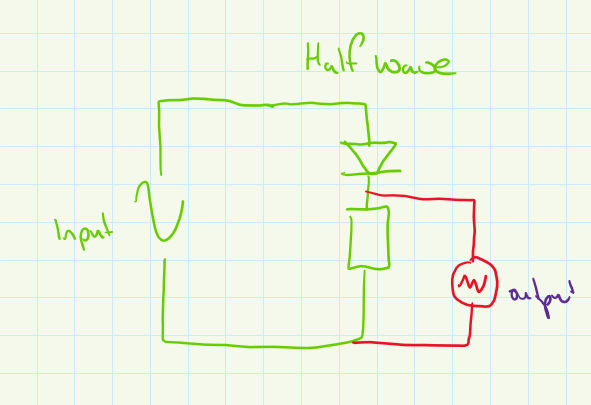
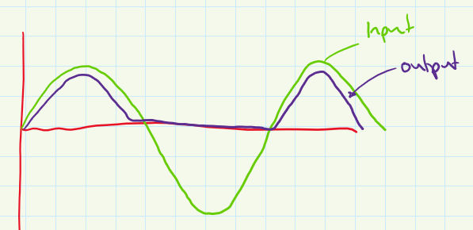

# Half Wave Rectifier
A [Half Wave Rectifier](Half%20Wave%20Rectifier.md) converts an [AC](../AC.md) input to a [DC](../DC.md) output.

Example [Circuit](../Circuits/Circuit.md) of a [Half wave rectifier](Half%20wave%20rectifier.md):

Example waveform of a [Half wave rectifier](Half%20wave%20rectifier.md):

The drop in [Peak Voltage](Peak%20Voltage.md) between the input & the output is because the [Current](../Ohms%20law/Current.md) flows though a [Diodes](../Diodes/Diodes.md), experiencing a [Voltage Drop](../Voltage/Voltage%20Drop.md) of 0.7V.