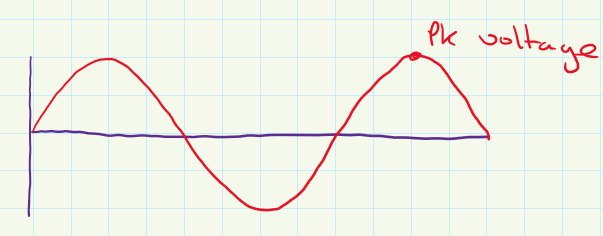

# Peak Voltage
The peak [Voltage](../Ohms%20law/Voltage.md) of an [AC](../AC.md) signal is the peak of the wave. However, when put through a rectifier to convert it to a [DC](../DC.md) signal the pk (peak voltage) gets reduced by 0.7V for each [diode](../Diodes/Diodes.md) it passes through.

