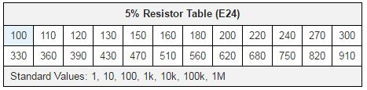

# Resistor
The [Resistor](Resistor.md) is a basic component used to create resistance in a [Circuit](../Circuits/Circuit.md).

Commercially available resistors come in values specified in the E24 series, shown below:[^1]

[^1]: Credit - [riedon.com](http://riedon.com/blog/e24-e48-e96-and-e192-resistor-values/)