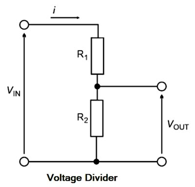

# Voltage Divider
The [Voltage Divider](Voltage%20Divider.md) equation / [Circuit](../Circuits/Circuit.md) can be used to find the [Voltage Drop](Voltage%20Drop.md) of a component.

The [Voltage Divider](Voltage%20Divider.md) [Circuit](../Circuits/Circuit.md) is shown bellow:[^1]

To measure the [Voltage](Voltage.md) of $R_2$ measure the [Voltage](Voltage.md) between $V_{out}$ and ground.
To measure the [Voltage](Voltage.md) of $R_1$ subtract the [Voltage](Voltage.md) over $R_2$ from $V_{in}$ .

Another way to calculate the [Voltage Drop](Voltage%20Drop.md) of a component is to use a ratio. This is especially useful when using $V_{out}$ isn't an option. To do this use the formula:
$V_{drop} =  ({V_{in}} * R_n)/{R_t}$
- $V_{drop}$ - [Voltage Drop](Voltage%20Drop.md).
- $V_{in}$ - Input [Voltage](Voltage.md).
- $R_n$ - [Resistance](../Ohms%20law/Resistance.md) of the component(s) to calculate the [Voltage Drop](Voltage%20Drop.md) over.
- $R_t$ - Total [Resistance](../Ohms%20law/Resistance.md) of the components in between $V_{in}$ and ground.

[^1]: Taken from [electricalexams.co](https://www.electricalexams.co/voltage-divider/).